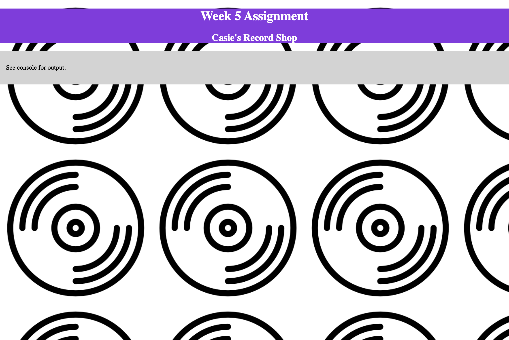

# Tier 1 Week 5

This week, we'll be exploring objects by creating an application to help maintain a record collection. We will be creating objects using `object literal` syntax.

**Reminder**: Make sure to answer this week's Slack discussion question!

## Part 1 - Practice with objects

Complete the `1-object-practice.js` file.

Follow the instructions in the comments to add the required code. (Please Do not remove the instruction comments!)

## Part 2 - Practice with HTML & CSS

Time to make our index.html page look cool!

Add all CSS through a Stylesheet. Do not use inline styles.

Update the HTML:

- Place the existing `h1` inside a `header` element.
- Add an `h2` element into the `header` that says `YOUR NAME's Record Shop`.
- Place the existing `p` inside a `main` element.

Add a Stylesheet:

- Create a `stylesheet.css` file and source it into the HTML file.
- Give the `header` a dark background color and choose a light  color for the text.
- Center the text in the `header`.
- Give the `main` a light grey background color.
- Look up the CSS `background-image` property to learn how to use the provided `record.png` as the background image on your page with a relative path.
- Look up CSS `background-repeat` to learn how to fill the body of the page with a repeating image.
- Look up CSS `margin` and `padding`.
  - Give the `body` a margin of `0`. (This removes the whitespace around the edges of the page.)
  - Give the `main` padding of `1em`. (Curious about `em`? Look up CSS units.)

Here's an example of what the style could look like:


__STRETCH GOAL:__ Use CSS style classes vs element names to do your styling, except for adding the margin to the `body`. That is a good thing to add to every CSS file, and it should use the `body` HTML tag name.

## Part 3 - Building a Music Collection

Update the `3-music-collection.js` file to do the following:

> While working through the features below, make sure to commit after you complete a task! Your commit message should reflect what you added or changed since the previous commit.

### Required Features

- Create a variable `collection` that starts as an empty array.

- Add a function named `addToCollection`. This function should:
  - Take in the album's `title`, `artist`, `yearPublished` as input parameters
  - Create a new object having the above properties
  - Add the new object to the end of the `collection` array
  - Return the newly created object

- Test the `addToCollection` function:
  - Add 6 albums to your collection. Aim to have a mix of both same and different artists and published years. (Feel free to share your musical interests, or make stuff up. Totally fine either way.)
  - Console.log each album as added using the returned value.
  - After all are added, console.log the `collection` array.

- Add a function named `showCollection`. This function should:
  - Take in an array parameter. (This allows it to be reused to show any collection, like the results from the find or search.)
  - Console.log the number of items in the array.
  - Loop over the array and console.log each album's information formatted like: `TITLE by ARTIST, published in YEAR`.

- Test the `showCollection` function.

- Add a function named `findByArtist`. This function should:
  - Take in `artist` (a string) parameter
  - Create an array to hold any results, empty to start
  - Loop through the `collection` and add any objects with a matching artist to the array.
  - Return the array with the matching results. If no results are found, return an empty array.

- Test the `findByArtist` function. Make sure to test with an artist you know is in the collection, as well as an artist you know is not in your collection. Check that for artists with multiple matches, all are found.

> When testing your functions, write all tests in the JavaScript file!


### Stretch goals

- Create a function called `search`. This function should:
  - Take an input parameter for a search criteria object. Create your solution based on a search object that has these properties:
  ```
  { artist: 'Ray Charles', year: 1957 }
  ```
  - The returned output from `search` should meet these requirements:
    - Return a new array of all items in the `collection` matching *all* of the search criteria.
    - If no results are found, return an empty array.
    - If there is no search object or an empty search object provided as input, then return all albums in the `collection`.

- Add an array of `tracks` to your album objects. Each track should have a `name` and `duration`. You will need to update the functions to support this new property:
  - Update the `addToCollection` function to also take an input parameter for the array of tracks.
  - Update `search` to allow a `trackName` search criteria.
  - Update the `showCollection` function to display the list of tracks for each album with its name and duration.
```
    TITLE by ARTIST, published in YEAR:
    1. NAME: DURATION
    2. NAME: DURATION
    3. NAME: DURATION
    TITLE by ARTIST, published in YEAR:
    1. NAME: DURATION
    2. NAME: DURATION
```

> Make sure to test all your code!
# week-4
